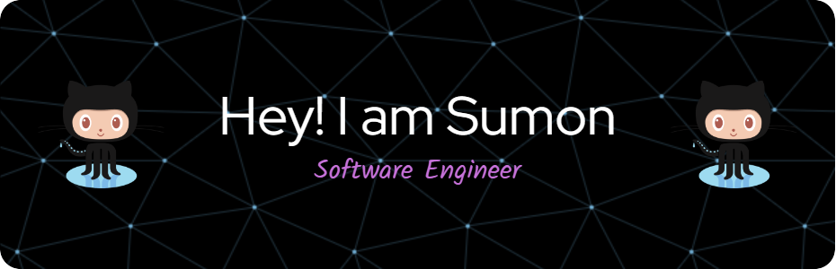

  

<h1 align="center">👋 Hi there, I'm Sumon Singh</h1>

Welcome to my GitHub profile!

## 🔭 I’m currently working on
**Distributed AI/ML systems**, infrastructure tooling, and performance optimization in large-scale training environments.

## 🌱 I’m currently learning
**Horovod**, **LLM training/inference pipelines**, **GPU Direct RDMA**, and exploring internals of **NCCL**, **UCX**, and **GDRCopy**.

## 👯 I’m looking to collaborate on
**Open-source projects** in **AI infrastructure**, **systems programming**, and **performance engineering**.

## 💬 Ask me about
**Python, C/C++, Linux, Docker, Jenkins, Bash, Java, Git, AWS EC2, Automation, Distributed Training**, and **Open-source contributions**.

## ⚡ Fun fact
> My commit messages tell a story – a tragic tale of bugs squashed, features conquered, and the occasional coffee spill. It's a novel in progress.

---

## 🚀 Highlights of My Work

### 🧠 AI/ML & Distributed Systems
- Fine-tuned **LLMs** and optimized inference pipelines for performance and scalability.
- Built and containerized **Horovod**-based distributed training setups using **Docker**.
- Debugged **NCCL** for improved communication efficiency in multi-node setups.
- Integrated **UCX** in deep learning environments.
- Applied **GPU Direct RDMA** and **GDRCopy** to accelerate memory transfer.
- Benchmarked using `nccl-tests` and `ib_perf`.

### ⚙️ DevOps, Automation & Infrastructure
- Built CI/CD pipelines with **Jenkins**, **Git**, **AWS EC2**, and **Python**.
- Developed CLI tools in **C** and **Python**.
- Wrote automation scripts in **Bash** and **Python** for deployments and monitoring.
- Built **packet manipulation tools** and **custom JSON parsers**.

### 📚 Engineering & Open Source
- Integrated data algorithms using **JNI**, shared libraries, **C/C++**.
- Contributed documentation and internal tooling.
- Advocates for **clean, performance-first code** and OSS collaboration.

## 🏆 Top Projects – Live Demos & Source Code

<table>
  <tr>
     <td width="25%">
      <h3>🧠 SeedGPT-StoryCrafter</h3>
      
AI for stories, tales & imagination

      <strong>Tech:</strong> PyTorch, Hugging Face, Streamlit   
      
      
    </td>
    <td width="25%">
      <h3>🧠 SeedGPT-22M</h3>
      
Compact, Efficient Small Language Model

      <strong>Tech:</strong> PyTorch, Hugging Face, Streamlit   
      
      
    </td>
    <td width="25%">
      <h3>🩺 DeepCareX</h3>
      
DeepCareX is an AI-powered healthcare system leveraging machine learning models for intelligent health insights

      <strong>Tech:</strong> TensorFlow, Keras, Flask, Docker   
      
      
    </td>
    <td width="25%">
      <h3>🎨 ArtVenture</h3>
      
Real-time AI filters and image transformations.

      <strong>Tech:</strong> OpenCV, Streamlit, Docker   
      
      
    </td>
  </tr>
</table>

## 📫 Connect With Me

---

## 💻 Skilled In

### 🖥️ Operating Systems
<code></code>
<code></code>

### 🔤 Languages
<code></code>
<code></code>
<code></code>
<code></code>
<code></code>

### 🧠 ML/DL
<code></code>
<code></code>
<code></code>
<code></code>
<code></code>
<code></code>

### 🌐 Web & DB
<code></code>
<code></code>
<code></code>
<code></code>
<code></code>

### ⚙️ DevOps Tools
<code></code>
<code></code>
<code></code>
<code></code>
<code></code>

## 🎓 Education

| University | Degree | Stream | Year | Score |
|-----------|--------|--------|------|--------|
| University of Mumbai, India | M.Sc | Computer Science (Data Science) | 2021–2023 | CGPI: 9.46/10 (82.71%) |
| University of Calcutta, India | B.Sc (Hons) | Computer Science | 2017–2020 | 633/800 (80%) |

---

## 📝 Publications

1. 🔍 [**Unveiling the Veil: A Comprehensive Assessment of Privacy and Security in Amazon Alexa**](https://ijisrt.com/unveiling-the-veil-a-comprehensive-assessment-of-privacy-and-security-in-amazon-alexa)  
   *International Journal of Innovative Science and Research Technology*  
   

2. 🧘 [**Yoga pose classification from images using transfer learning**](https://ijirt.org/Article?manuscript=167821)  
   *International Journal of Innovative Research in Technology*  
   

---

## 🐳 Docker Images

📦 Find my Docker images on <a href="https://hub.docker.com/u/sumon2j"><strong>DockerHub: sumon2j</strong></a>

<table>
  <tr>
    <td width="48%">
      <h3>🩺 DeepCareX</h3>
      
Multi-disease diagnostics AI system.

      <code>docker pull sumon2j/deepcarex:latest</code>  
      
    </td>
    <td width="48%">
      <h3>🎨 ArtVenture</h3>
      
Image AI filters and transformations.

      <code>docker pull sumon2j/artventure</code>  
      
    </td>
  </tr>
</table>

---

## 🏆 GitHub Trophies

  

---

## 📊 Stats

---

  

